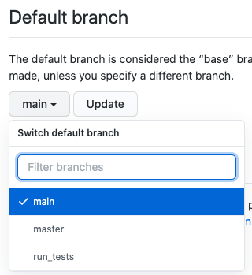

# github-repo-starter-template

A starter repo for new projects. Adds CI and build/release defaults, and setup instructions using good practices.

It currently includes:

- Instructions to get started
- Pull request creation and updates (i.e. where you might want to run tests)
- Protecting your `main` branch

## Instructions

This will guide you through getting setup with this repo's default files and practices.

### Create a new repo

This will setup a new repo with the files from within this one.

1. [Create a new repo via import](https://github.com/new/import)
1. In **Your old repository's clone URL** enter this repo's HTTPS URL: `https://github.com/jeffmaher/github-starter-template.git`
1. Add an owner, repo name, and privacy level; then click **Begin Import**.
1. Wait a moment; take a quick tea break. ☕️

### Set default branch (i.e. don't use `master`)

_Note: Eventually GitHub will [do this for you](https://www.bbc.com/news/technology-53050955), but they haven't yet._ 

You'll want to change your default branch from `master` to `main`, as a sign of respect for other people.

1. Go to your new repo in GitHub on the web.
1. Click the Branch menu.
1. Type `main` and hit Enter: 
    - 
1. Go to Settings tab / Branches / Default Branch
1. Choose `main` instead of `master`, then click **Update**.
    - 
1. Go back to the Code tab, then click on **# branches** (you probably have 2 branches at this point)
1. Click the garbage can next to the `master` branch
    - 

### Configure pull requests jobs

You'll likely be running tests or running static analysis tools when pull requests are created, updated (i.e. a new commit comes in), or re-opened (after being closed). For any job that you want GitHub Actions to run at pull request time, either modify or add jobs to the [`.github/workflows/pull_request.yml`](.github/workflows/pull_request.yml) file.

The workflow assumes that you'll want a checked out copy of your repository, and the first job does that. The example jobs after it all run in parallel after the `checkout` job completes.

